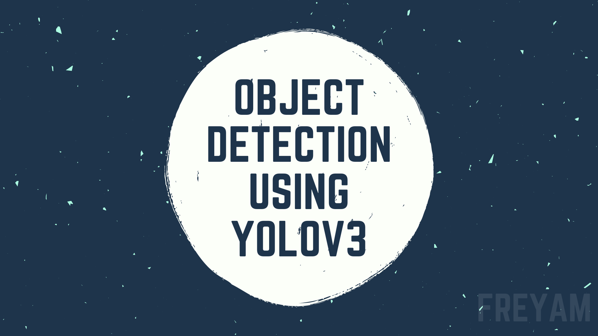
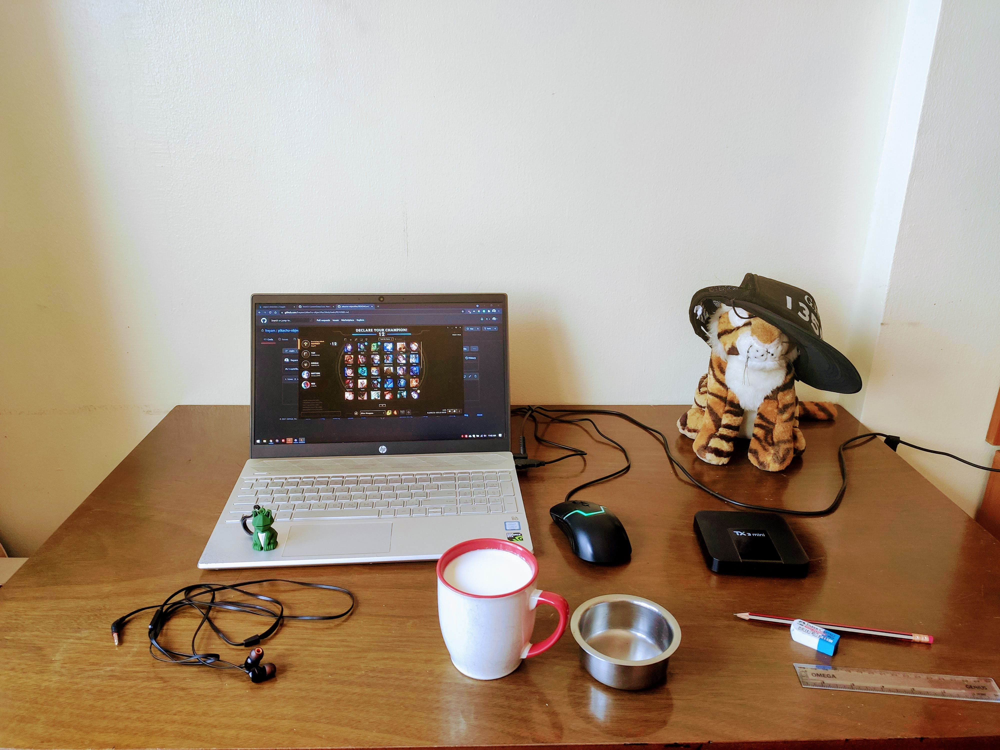
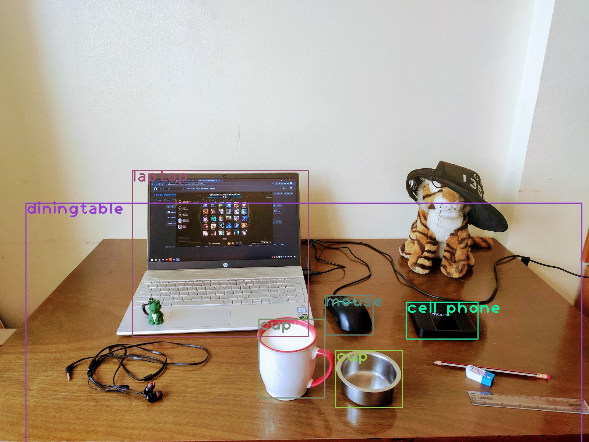

A Jupyter Notebook demonstrating Object Detection using [YOLOv3](https://pjreddie.com/darknet/yolo/) (You Only Look Once). YOLO, is one of the faster object detection algorithms out there. Though it is no longer the most accurate object detection algorithm, it is a very good choice when you need real-time detection, without loss of too much accuracy.

YOLO Version: `v3`
Kaggle Link: https://www.kaggle.com/freyam/object-detection/

## Original Image

## Magic Image

Special Thanks to [@iamsahil007](https://github.com/imsahil007) for introducing me to YOLO!
